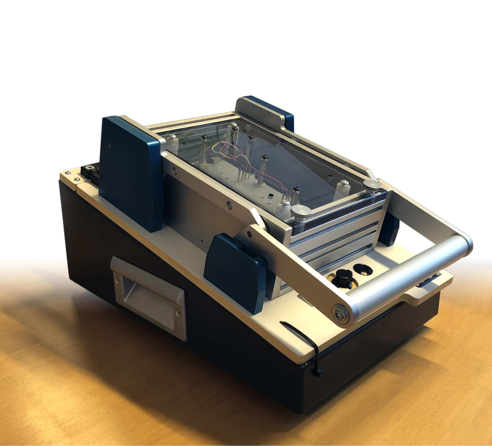

# Crownstone programmer
The programmer is used to program (flash) and test Crownstones.

In the docs dir you will find:
- [Manual](docs/MANUAL.md), explaining the usage of the programmer.
- [Setup](docs/SETUP.md), how to setup a new Raspberry Pi.
- [Overview](docs/OVERVIEW.md), a description of all the hardware and software components.
- [Update](docs/UPDATE.md), a guide for new firmware or hardware.

**Everything in the vendor folder is not covered by our licenses.**
