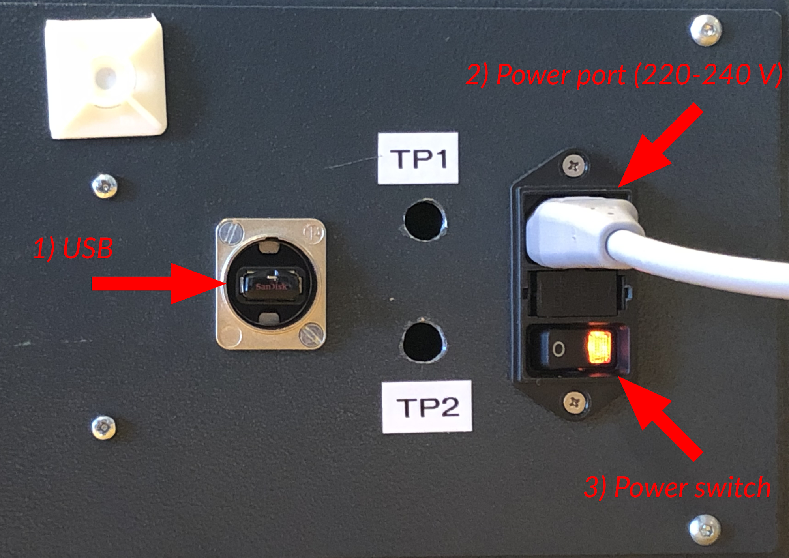
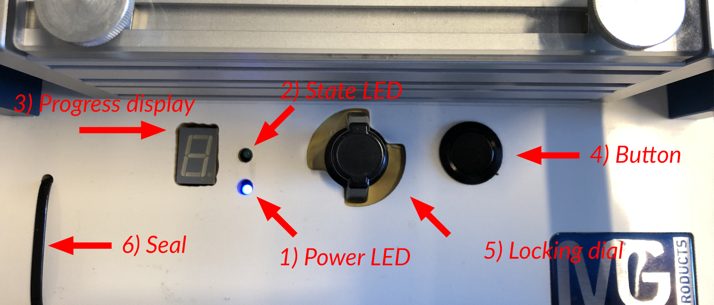
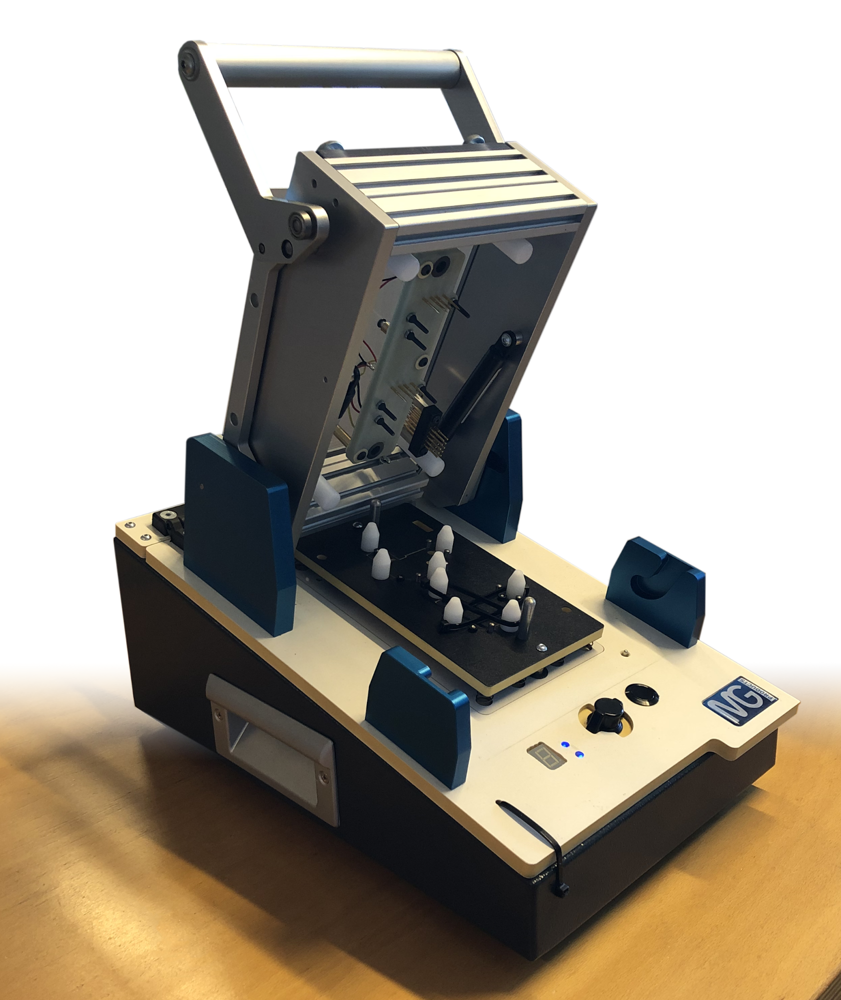
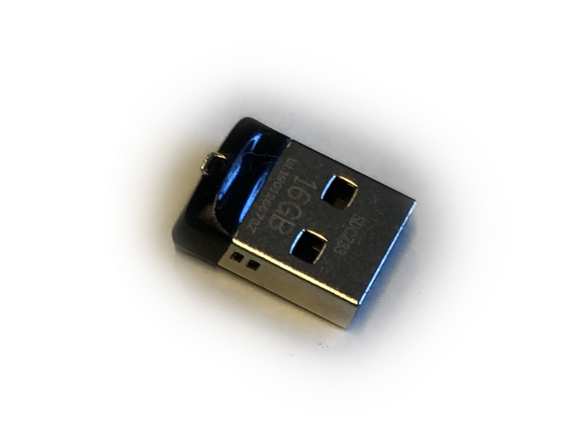
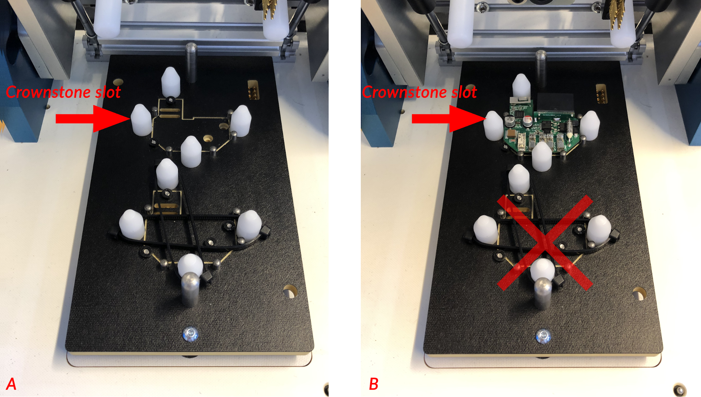
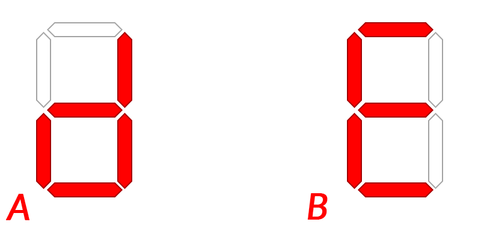

# Manual

This manual describes how to program and test Crownstones, given a programmer with USB stick.

## Intro

This is the Programmer:

On the back there are 2 ports and a switch:

To start using the Programmer, insert the power cable into the power port (Picture 2, part 2) and turn the switch ON (Picture 2, part 3). The switch is ON when the light in the switch is shining.

On the top of the Programmer, there 2 LEDs, 1 Display, 1 locking dial, and 1 button.

## Usage

When the Programmer is powered, the Power LED should be on (Picture 3, part 1). The Programmer will start up and will be ready 60 seconds after the power is turned on.

Open the lid so the Programmer is in the OPEN state:

When the normal USB drive is inserted into the USB port on the back, the *State LED* will blink slowly.

There are two slots in the programmer for Crownstone Builtins as shown in the picture below. Only the top one should be used. The bottom one is not connected.

Insert a Crownstone into the open slot and close the lid.

The *State LED* should now be blinking quickly. This means that the programmer is ready to start.

Press the button to start the process. The *State LED* will now be fully on.
The *Progress display* will now start circling. Once it stops circling, it will blink either a `d` or an `E` with a numeric code.

If the *Progress display* is blinking a `d` (left side of the picture above), the process is successful.
If it is blinking an `E` (right side of the picture above) and an error code, you can look at the [error codes table](#error-codes) for information on what to do next.

## Error codes
Error codes start with an `E` symbol and blink numbers. These are looping, this means if you see as E... 2... 1... E... 2... 1... etc, this mean the error code is E21.

Error code | Cause                                  | Step to resolve
---------- | -------------------------------------- | ----------------
E0         | Unknown                                | [Restart test](#restart-test)
E11        | Crownstone not found after programming | [Crownstone not found](#crownstone-not-found)
E12        | Error in programmer                    | [Reset programmer](#reset-programmer)
E21        | Error while programming                | [Reset programmer](#reset-programmer)
E22        | Crownstone not found                   | [Crownstone not found](#crownstone-not-found)
E23        | Error while programming                | [Reset programmer](#reset-programmer)
E24        | 3v3 on Crownstone too low              | [Rework 3v3](#rework-3v3)
E3         | Thermal fuse is broken                 | [Rework thermal fuse](#rework-thermal-fuse)
E41        | Crownstone not broadcasting            | [Restart test](#restart-test)
E41        | Crownstone not in setup mode           | [Crownstone not broadcasting](#crownstone-not-broadcasting)
E5         | Signal too weak                        | [Signal too weak](#signal-too-weak)
E6         | Could not setup Crownstone             | [Setup failed](#setup-failed)
E71        | Relay did not turn on                  | [Restart test](#restart-test)
E72        | Relay did not turn off                 | [Restart test](#restart-test)
E8         | Power measurement broken               | [Fix power measurement](#fix-power-measurement)
E91        | IGBT Q1 broken                         | [Rework IGBT](#rework-igbt)
E92        | IGBT Q2 broken                         | [Rework IGBT](#rework-igbt)
E93        | IGBT power source broken               | [Rework IGBT power source](#rework-igbt-power-source)
E94        | IGBT did not turn on                   | [Restart test](#restart-test)

### Reset programmer
- Switch off the power switch.
- Wait 10 seconds.
- Switch on the power switch.
- Wait for the *State LED* to start blinking before moving on.

### Restart test
- Open lid.
- Wait 3 seconds.
- Close lid.
- Wait for *State LED* to blink quickly.
- Press button.

### Crownstone not found
- Open lid.
- Check if the Crownstone is inserted into the top slot correctly.
- Close lid.
- Wait for *State LED* to blink quickly.
- Press button.

### Rework 3v3
- Check diode D1, D2 and D5.

### Signal too weak
- Check antenna placement, shape and impedance match.
- First [reset the programmer](#reset-programmer) and retry the test.
- If this does not work after the restart try another Crownstone.
- If multiple Crownstones get this error, contact us.

### Crownstone not broadcasting
- First [reset the programmer](#reset-programmer) and retry the test.
- If this does not work after the restart try another Crownstone.
- If multiple Crownstones get this error, contact us.

### Rework thermal fuse
- Verify that thermal fuse F1 is not conducting.
- If F1 is not conducting, replace F1.
- If F1 is not broken, the relay is broken.
- Replace relay.

### Setup failed
- First [reset the programmer](#reset-programmer) and retry the test.
- If this error occurs again on this same Crownstone, try with another one.
- If multiple Crownstones get this error, contact us.

### Fix power measurement
- Please check instruction regarding placement of shunt. Known to be sensitive.

### Rework IGBT
- Measure if the IGBTs are broken.
- If the error is E921, Q1 is most likely broken. E922 means Q2 is broken.
- Replace broken IGBTs.

### Rework IGBT power source
- Measure if the IGBTs are broken,
- Either **both** IGBTs are broken, or the power source is not working.
- If the IGBTs are broken, replace Q1 and Q2.
- If the IGBTs are fine, check R2, C4.

## Troubleshooting

In case there is a problem, here is how you can fix it!

### Display not on
In case the *Progress display* does not turn on when the *State LED* is fully on after the button was pressed, follow [reset programmer](#reset-programmer).

### State LED is off
In case the *State LED* is not lighting up after turning on the power:
- If the Programmer has just been powered on, wait 60 seconds.
- If that does not fix it:
  - Remove the USB drive from the USB port.
  - Wait 5 seconds.
  - Insert the USB drive back into the USB port.
  - Wait 5 seconds for the State LED to start blinking.
  - If that does not work, follow [reset programmer](#reset-programmer).

### Power LED is off
In case the *Power LED* is off, ensure the power cable is securely connected to the power port. Also, the power switch must be on. If the light in the power switch remains off and the power cable is not broken, you can check the fuses just above the power switch. If these are busted, replace the fuses.

### The test fails for all Crownstones
- Follow [reset programmer](#reset-programmer).
- If that does not work (and it has been tried 4 times, for multiple Crownstones).
  - Contact us for permission to use the *Emergency USB drive*.
    - If you have perssion, follow [Emergency backup drive]().

## Emergency backup drive

** Explicit permission from the Crownstone team is required before following these steps. **

There is an Emergency USB drive hidden within the programmer. This will just load firmware onto the Crownstone and does **not** test anything.

To get it:
- Cut the seal.
- Rotate the locking dial counter clockwise.
- Open the programmer by lifting up the cover.
- Locate the Emergency USB drive, see picture below.
- Cut away the bands holding it in place (**do not cut anything else**).
- Insert the Emergency USB drive into the USB port on the back of the programmer.
- Follow [reset programmer](#reset-programmer).

